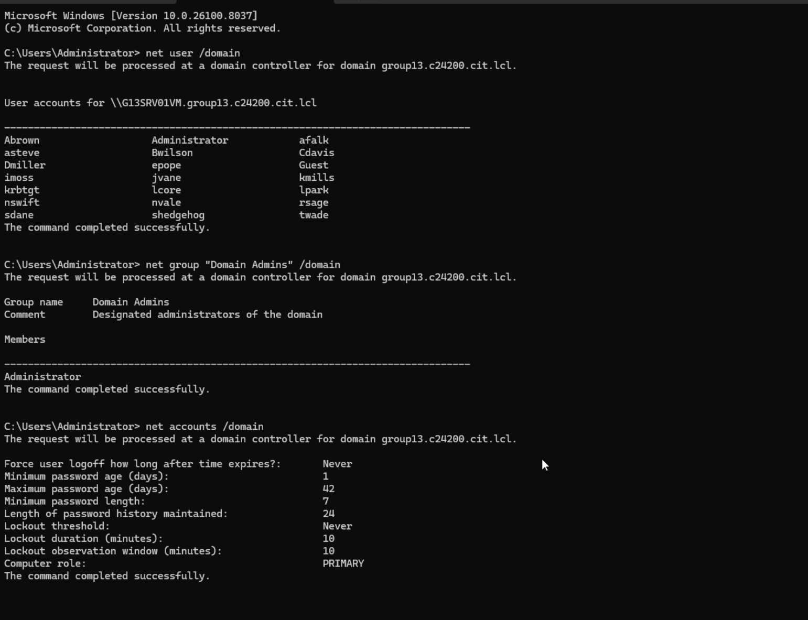

#  Enterprise Active Directory Defense & HCI Network Containment

## Executive Summary
This project demonstrates the design, deployment, and offensive validation of a virtualized enterprise environment using **Nutanix Community Edition (HCI)** and **Windows Server 2025**. 

The core objective was to architect a modern Active Directory (AD) infrastructure and subsequently subject it to a targeted attack simulation. By executing identity reconnaissance, password spraying, and lateral movement attempts, this project proves a critical enterprise security principle: **Assume Breach**. While weak perimeter identities (passwords) can be compromised, a properly hardened internal architecture utilizing strict Least Privilege and network segmentation will successfully contain the blast radius and protect the Domain Controller.

## Tech Stack
* **Hyperconverged Infrastructure (HCI):** Nutanix Community Edition (Prism Central, AHV)
* **Identity & Access Management (IAM):** Active Directory Domain Services (AD DS), Kerberos
* **Operating Systems:** Windows Server 2025 (Domain Controller), Windows 11 (Endpoints)
* **Offensive Tactics:** Password Spraying, SPN Enumeration (Kerberoasting prep), Lateral Movement
* **Defensive Controls:** Principle of Least Privilege (PoLP), Network Segmentation, Access Control Lists (ACLs)

---

##  System Architecture & Threat Model

The environment was built by converting physical systems into a fully virtualized, multi-cluster architecture managed through Nutanix Prism Central. 

  
   
  <b>Figure 1: Enterprise Architecture & Attack Containment Flow</b>

### The "Assume Breach" Paradigm:
* **Infrastructure Layer:** Nutanix clusters hosting standard enterprise templates (Windows 11 Workstations and Windows Server 2025 DC).
* **The Attack Vector:** Simulating an insider threat or compromised workstation attempting to escalate privileges and move laterally to the `group13.c24200.cit.lcl` Domain Controller.
* **The Containment Strategy:** Relying on robust AD group policies and network access controls to neutralize the threat post-authentication.

---

##  Phase 1: Enterprise Infrastructure Provisioning (Nutanix)

The foundation of the project required deploying a scalable, centrally managed virtualization layer. 

### 1. Nutanix Cluster & VM Deployment
The environment utilizes Nutanix Prism Central to manage multiple host nodes and virtual machines provisioned from standardized OS templates, reflecting modern enterprise infrastructure practices.

  

  

### 2. Active Directory & FSMO Role Configuration
A Windows Server 2025 Virtual Machine was promoted to a Domain Controller. To ensure authoritative directory services, all Flexible Single Master Operation (FSMO) roles were successfully validated and assigned to the primary DC (`G13SRV01VM`).

  

---

##  Phase 2: Threat Simulation & Initial Compromise

With the infrastructure established, the project shifted to an offensive posture to evaluate the AD security baseline.

### 1. Identity Reconnaissance & Password Spraying
Standard Windows command-line tools (`net user /domain`) were used to enumerate valid domain accounts. This reconnaissance phase successfully mapped out the available identity targets for the upcoming attack.

  

Once the user list was acquired, a simulated password spraying attack was executed against the domain policies.

### 2. Successful Account Compromise
The password spray successfully compromised the account `abrown`. A shell was spawned under the context of this compromised user, granting the attacker initial authenticated access to the domain.

  

### 3. Attack Surface Discovery (SPN Enumeration)
To prepare for potential privilege escalation, the attacker enumerated Service Principal Names (SPNs) using `setspn -Q */*`. The discovery of registered SPNs confirms the presence of Kerberos-authenticated services, exposing the environment to realistic attack vectors like Kerberoasting.

  

---

## 🛡️ Phase 3: Defensive Posture Validation & Containment

The true test of the architecture was how it responded *after* the initial perimeter was breached.

### 1. Verification of Least Privilege
Following the compromise, the attacker attempted to assess their access level. Queries using `whoami /groups` and `whoami /priv` confirmed that the `abrown` account was restricted strictly to standard domain groups and possessed zero administrative privileges. 

  

  

*Result: The Principle of Least Privilege (PoLP) was successfully enforced, preventing immediate local privilege escalation.*

### 2. Lateral Movement Blocked (Blast Radius Contained)
The critical phase of the simulation involved attempting to pivot from the compromised workstation to the Domain Controller. The attacker attempted to enumerate network shares (`net view`) and directly access administrative shares (`\\G13SRV01VM\C$`).

  

*Result:* The environment strictly rejected these requests (`System error 6118` and `Access is denied`). The combination of network segmentation between the Nutanix clusters and strict AD Access Control Lists (ACLs) successfully neutralized the attacker's ability to move laterally.

---

##  Strategic Impact & Security Outcomes

* **Validated "Assume Breach" Resilience:** Proved that successful identity compromise (via password spraying) does not automatically result in domain compromise if robust internal controls are present.
* **Blast Radius Containment:** Demonstrated how combining Hyperconverged Infrastructure (HCI) network segmentation with strict Active Directory ACLs traps attackers on their initial beachhead.
* **Enforcement of Least Privilege:** Verified that standard user accounts lacked the administrative rights necessary to alter system configurations or access critical DC file shares, effectively stalling the cyber kill chain.
* **Enterprise-Ready Deployment:** Successfully architected and managed a multi-node, virtualized Windows Server 2025 domain environment mirroring Fortune 500 infrastructure standards.
